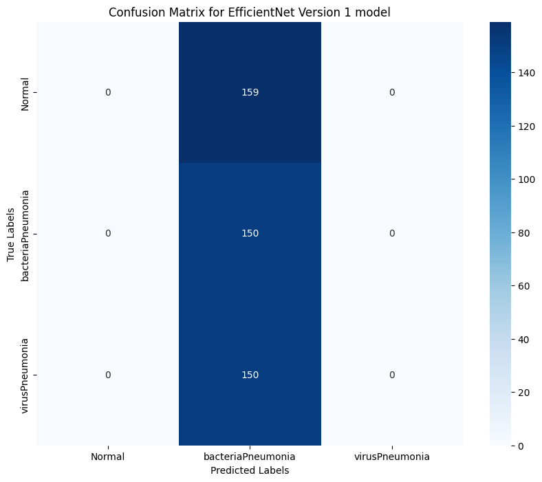
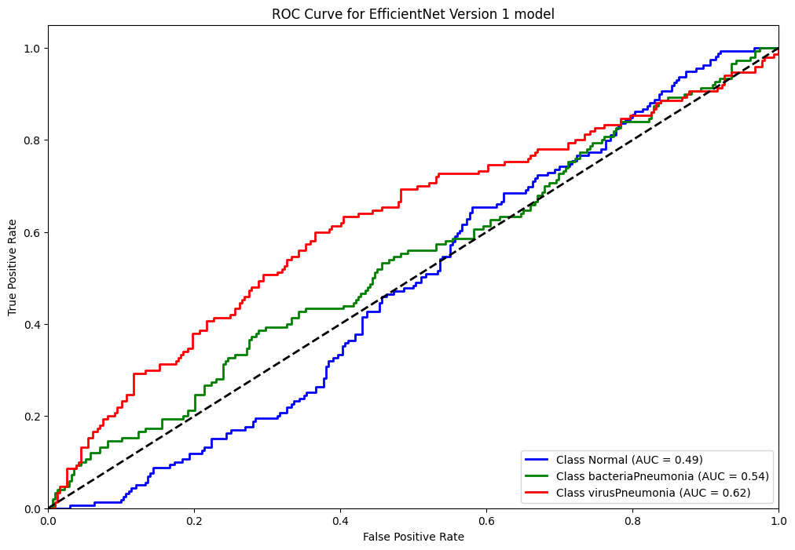

# Reporte del Modelo Baseline
## Descripción del modelo

Para abordar el problema de clasificación de imágenes en el diagnóstico de neumonía a partir de radiografías, hemos seleccionado los modelos VGG16 y EfficientNetB0, ambos disponibles en TensorFlow. Esta elección se justifica debido a que ambos modelos son redes neuronales convolucionales bien probadas en tareas de reconocimiento de imágenes y permiten capturar características visuales esenciales en radiografías. VGG16, con su arquitectura profunda y secuencial, es eficaz en detectar patrones sutiles y texturas asociadas a los signos de neumonía, como opacidades pulmonares.

## Variables de entrada

La imagen ha sido procesada en un formato de 500x500 píxeles, lo que significa que, al ingresar a la primera capa, se dispone de una matriz de 500x500 valores de entrada.

## Variable objetivo

La variable objetivo es la condición del paciente, es decir, es una variable categorica que puede variar su valor entre **NORMAL**, **VIRUS** y **BACTERIA**.

## Evaluación del modelo

### Métricas de evaluación

Se utlizaron como metricas principales:
1. precision         
2. recall
3. f1-score
Todos los anteriores son representados en una matriz de confusion y una curva roc, como veremos en el siguiente punto. 
### Resultados de evaluación

A continuacion disponemos los resultados

## Análisis de los resultados

EfficientNet, como primera aproximación a la solución, presenta un problema significativo al momento de clasificar las imágenes: todas son clasificadas en la misma categoría (en este caso, neumonía), lo que da lugar a una aproximación extremadamente errónea. No obstante, esta versión inicial ofrece una base interesante que podría ser útil para futuras iteraciones, modelos y versiones, lo que abre posibilidades para mejorar y ajustar el enfoque.

## Conclusiones

El rendimiento es deficiente, pero nos permite concluir que EfficientNet no ofrece una solución válida para nuestro problema. Como opción de mejora, se plantea experimentar con los parámetros del modelo para ver si se puede obtener una mejora. En caso de no ser así, la alternativa será probar con otro modelo para intentar obtener mejores resultados.

